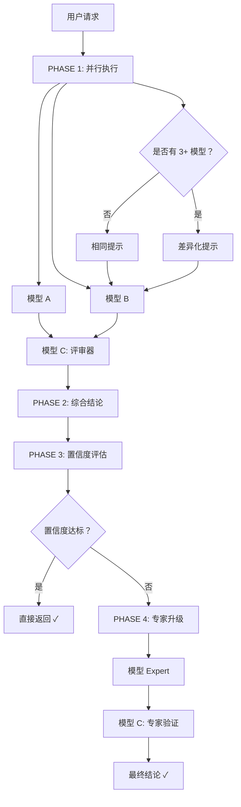
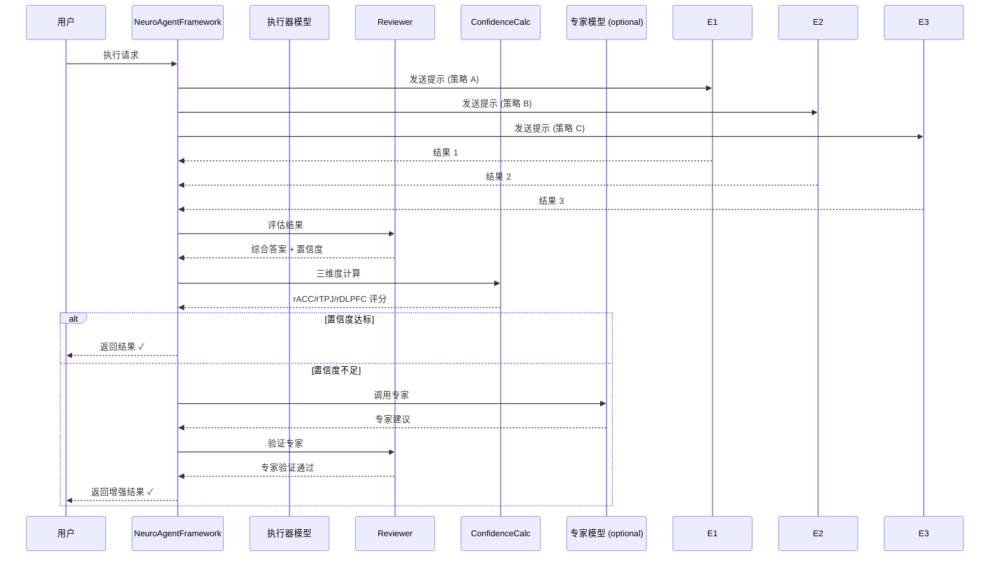
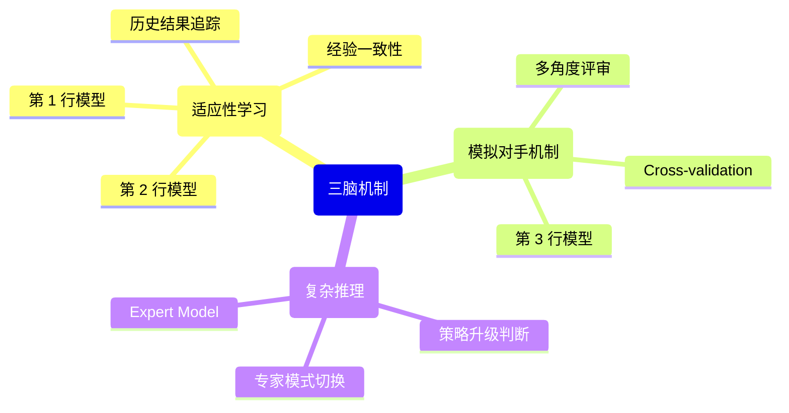
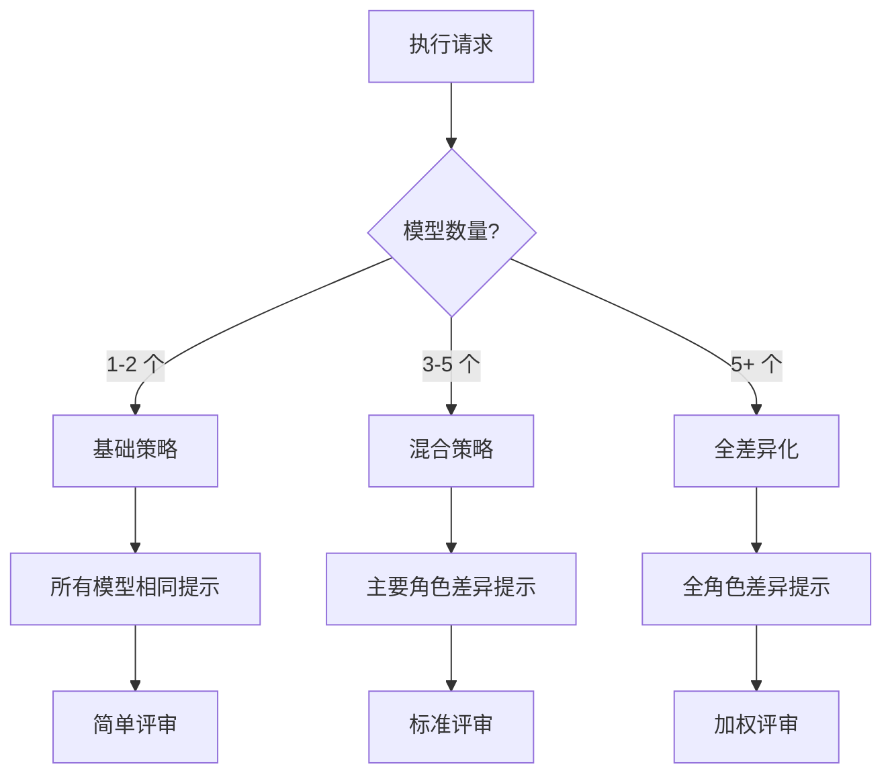

# NeuroAgent Framework v2.0

**纯`vibe`编程，我没看细节。下一步有一时间也确实有需求的话，考虑真的弄一下。** 🤣

[神经科学启发的灵活多模型协作框架]

基于 **Harness Engineering**、**The Advisor Strategy** 和 **神经心理学（rACC/rTPJ/rDLPFC 三脑机制）** 的创新框架，实现成本效率最优的 AI Agent 系统。

## 📦 快速开始

```bash
# 安装
pip install neuro-agent-framework

# 使用
from neuro_agent_framework import NeuroAgentFramework
```

## 🎯 核心特性

| 特性 | 描述 |
|------|------|
| **灵活模型配置** | 2 到 N 个便宜执行器 + 专家模型 |
| **神经化置信度** | rACC/rTPJ/rDLPFC 三维度评估 |
| **自适应策略** | 根据模型数量自动选择执行策略 |
| **专家升级** | 置信度不足时自动调用昂贵专家 |
| **双评审机制** | Harness 评审 + 专家验证 |

## 🧠 LLM 模块支持

首版实现 **OpenAI 兼容接口**，支持多种 LLM 提供商：

| 提供商 | 支持情况 | 说明 |
|--------|----------|------|
| OpenAI 官方 | ✅ 已实现 | GPT-3.5, GPT-4 系列 |
| Azure OpenAI | ✅ 已实现 | 企业级部署 |
| OpenRouter | ✅ 兼容 | Claude, Gemini 等 |
| LocalAI/Ollama | ✅ 兼容 | 本地部署 |

**快速使用 LLM 模块**：

```python
# 方式 2: 使用 JSON 配置文件
from neuro_agent_framework import NeuroAgentFramework, ConfigLoader

# 配置加载器会自动读取 config/llm_config.json
config_loader = ConfigLoader()
if config_loader.load():
    # 获取模型的 LLM 配置
    llm_config = config_loader.get_config("qwen3.5_2b")
else:
    # Fallback: 使用默认配置
    llm_config = LLMConfig(
        model="gpt-3.5-turbo",
        api_key="sk-your-key"
    )

llm = NeuroAgentFramework(llm_config)
```

### JSON 配置文件格式

配置文件位于 `config/llm_config.json`：

```json
{
  "_metadata": {
    "version": "2.1.0",
    "description": "LLM 配置 - 支持 OpenAI 兼容接口"
  },
  "models": {
    "qwen3.5_2b": {
      "name": "qwen3.5:2b",
      "description": "2B 模型 - 便宜执行器 A",
      "role": "rACC_STANDARD",
      "config": {
        "model": "qwen3.5:2b",
        "api_base": "http://x.x.x.x:xxxx/v1",
        "api_key": "",
        "temperature": 0.7,
        "max_tokens": 2048
      }
    },
    "gemma_2b": {
      "name": "gemma4:e2b",
      "description": "2B 模型 - 便宜执行器 B",
      "role": "rACC_ALTERNATIVE",
      "config": {
        "model": "gemma4:e2b",
        "api_base": "http://x.x.x.x:xxxx/v1",
        "api_key": "",
        "temperature": 0.7,
        "max_tokens": 2048
      }
    },
    "qwen_35b_expert": {
      "name": "qwen3.5:35b",
      "description": "35B 模型 - 专家模型",
      "role": "rDLPFC_UPGRADER",
      "config": {
        "model": "qwen3.5:35b",
        "api_base": "http://x.x.x.x:xxxx/v1",
        "temperature": 0.3,
        "max_tokens": 4096
      }
    }
  }
}
```

### 快速开始示例

```python
from neuro_agent_framework.llm.base import Message, MessageRole
from neuro_agent_framework.llm.config_loader import ConfigLoader
from neuro_agent_framework.llm.factory import LLMFactory

# 方式 1: 从 JSON 配置加载
config_loader = ConfigLoader()
if config_loader.load():
    llm = LLMFactory.create("openai", config_loader.get_config("qwen3.5_2b"), "example")
else:
    # Fallback: 手动创建配置
    config = LLMConfig(model="gpt-3.5-turbo", api_key="sk-key")
    llm = LLMFactory.create("openai", config, "example")

# 使用 LLM
messages = [
    Message(role=MessageRole.USER, content="你好！")
]
response = llm.chat(messages)
print(response.content)
llm.close()
```

更多示例请查看：[examples/](examples/) 目录

## 🏗️ 框架架构

### 整体架构图



### 数据流图



## 🔬 神经科学启发

### 三脑机制映射



## 🚀 使用示例

### 示例 1：简单配置（2 个执行器）

```python
from neuro_agent_framework import NeuroAgentFramework, FrameworkConfig

# 创建简单配置
registry = FrameworkConfig.create_simple_config()

# 初始化框架
framework = NeuroAgentFramework(registry)

# 执行任务
result = framework.execute(
    request="设计电商推广方案",
    task_complexity=0.7
)

print(f"置信度：{result.confidence:.2f}")
print(f{使用专家：{result.used_expert}")
```

### 示例 2：高级配置（多视角）

```python
from neuro_agent_framework import NeuroAgentFramework

registry = FrameworkConfig.create_advanced_config()

framework = NeuroAgentFramework(
    model_registry=registry,
    thresholds={'combined_threshold': 0.75}
)

result = framework.execute(
    request="制定 AI 产品策略",
    task_context={"target": "enterprise"},
    task_complexity=0.85
)
```

## 🔧 模块说明

### Core - 核心组件

```
core/
├── enums.py          # ModelType, ModelRole
└── dataclasses.py    # RegisteredModel, ModelResult
```

### Registry - 模型注册

```
registry/
└── model_registry.py # 动态注册、查询、管理
```

### Strategy - 执行策略

```
strategy/
├── base_strategy.py          # 抽象基类
├── basic_strategy.py         # 简单并行（2 模型）
├── diversified_strategy.py   # 差异化策略（3+ 模型）
└── hybrid_strategy.py        # 自动选择策略
```

### Calculator - 置信度计算器

```
calculator/
└── neuro_confidence.py # rACC/rTPJ/rDLPFC 三维度评估
```

### Reviewer - 评审器

```
reviewer/
└── reviewer.py # 结果聚合、合成、验证
```

### Framework - 主框架

```
framework/
├── framework.py    # NeuroAgentFramework 主类
└── config.py       # 配置生成器
```

## ⚙️ 配置选项

```python
# 自定义阈值配置
thresholds = {
    'consistency_threshold': 0.75,  # rACC
    'completeness_threshold': 0.70, # rTPJ
    'reliability_threshold': 0.80,  # rDLPFC
    'combined_threshold': 0.80,     # 总体
}

# 动态配置 API
config_api = FrameworkConfigAPI(framework)

# 运行时添加执行器
config_api.add_executor(
    model_id="model_c",
    name="Model-Critical",
    role=ModelRole.rACC_DIVERSE_CRITICAL
)

# 切换评审器
config_api.set_reviewer("model_premium_reviewer")

# 调整阈值
config_api.set_threshold("combined_threshold", 0.9)
```

## 🎨 执行策略选择



## 🛡️ 安全特性

- ✅ **模型隔离**：每个执行器独立运行
- ✅ **结果验证**：双评审机制防止幻觉
- ✅ **成本可控**：专家调用阈值保护
- ✅ **可解释性**：置信度分解清晰可追溯

## 📈 路线图

- [x] **v0.1.0** - MVP 实现
- [x] **v0.2.0** - 模块化重构
- [x] **v0.2.1** - OpenAI 兼容 LLM 集成 ✨
- [x] **v0.2.2** - JSON 配置文件支持
- [x] **v0.2.3** - 异步并发优化
- [ ] **v0.3.0** - 企业版特性

## 🔗 参考资源

- [NeuroAgent Framework GitHub](https://github.com/zeerd/NeuroAgent)
- [Harness Engineering 文档](https://martinfowler.com/articles/harness-engineering.html)
- [The Advisor Strategy](https://claude.com/blog/the-advisor-strategy)
- [Neural Correlates of Interactions between Adaptive Learning and Hierarchical Reasoning in Repeated Strategic Games](https://hal.science/hal-05357081v1/document)
